# Hi, I'm Jonathan

Industrial Engineer who shifted to Frontend development, please visit my portfolio for more detail: www.jonathancuntodiaz.com

##  Stats

## About Me
### Web & Mobile Development

### Data & Artificial Intelligence

* **Specialties:** LLM Integration, Machine Learning, Pandas, Spark, Looker, and ETL pipelines.

